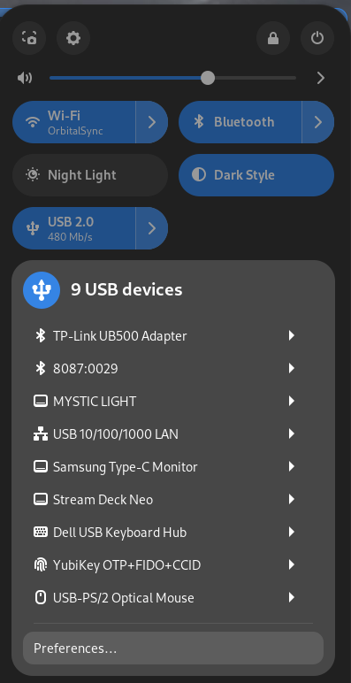

# USBee

A GNOME Quick Settings indicator for USB and USB-C diagnostics.

USBee mounts a tile next to Wi-Fi, Bluetooth, and Sound. The subtitle
shows live charging wattage and link speed; the popover lists every
attached USB device and USB-C port with a plain-English diagnostic per
port ("Charging at 65 W (PD 3.0)", "Cable limited to USB 2.0", etc.).

USBee is the GNOME-side companion to the
[`usbeehive`](https://github.com/abrauchli/usbeehive) daemon. The
extension itself performs no `/sys`, udev, or subprocess access — all
USB knowledge flows through `usbeehive` over D-Bus.

## Screenshot



## Status

Current release: v2.0.0. Pre-1.0 in spirit; the D-Bus interface
with `usbeehive` is considered stable, but UI details may still change.

## Requirements

- GNOME Shell **46, 47, 48, 49, or 50** (48-50 untested, only API-checked. Happy to take bug reports or success stories)
- The [`usbeehive`](https://github.com/abrauchli/usbeehive) daemon running
  on the session bus (`systemctl --user enable --now usbeehive`)

Without `usbeehive`, the tile renders an empty state explaining that the
daemon is not running. The extension auto-recovers when the daemon
appears or disappears on the session bus.

## Install

### From extensions.gnome.org (recommended)

*(EGO listing pending review — link will land here once approved.)*

### From a GitHub Release

1. Download `usbee@bitcreed.us.shell-extension.zip` from the
   [latest release](https://github.com/abrauchli/usbee/releases/latest).
2. Install it:
   ```
   gnome-extensions install --force usbee@bitcreed.us.shell-extension.zip
   ```
3. Log out and back in (Wayland) or `Alt+F2` → `r` (Xorg).
4. Enable it:
   ```
   gnome-extensions enable usbee@bitcreed.us
   ```

### From source

```
git clone https://github.com/abrauchli/usbee.git
cd usbee
gnome-extensions pack usbee@bitcreed.us --extra-source=src --force
gnome-extensions install --force usbee@bitcreed.us.shell-extension.zip
```

Then log out / back in and enable as above.

## Preferences

Open via the Extensions app or:

```
gnome-extensions prefs usbee@bitcreed.us
```

Per-port mute preferences for `CapabilityDegraded` notifications are
persisted in the GSettings schema `us.bitcreed.usbee`.

## Repository layout

- `usbee@bitcreed.us/` — the actual extension code. This is what ships.
  - `extension.js`, `prefs.js` — lifecycle entry points
  - `src/` — tile, popover, D-Bus client, store, notifier, icon mapping
  - `schemas/` — GSettings schema
  - `po/` — translations (English-only for v1)
- `.planning/` — internal planning artifacts (ADRs, phase plans,
  research). Not part of the published extension. Useful for
  understanding *why* the code looks the way it does.
- `CLAUDE.md` — contributor / AI-assistant guide. Includes the release
  process.

## License

GPL-3.0-or-later. See [LICENSE](LICENSE).

## Related projects

- [`usbeehive`](https://github.com/abrauchli/usbeehive) — the daemon
  that owns all USB / `/sys` / udev knowledge and publishes
  `org.usbeehive.Devices1` on the session bus.
- [WhatCable](https://github.com/darrylmorley/whatcable) — the macOS
  menu-bar app USBee is conceptually modeled on.
